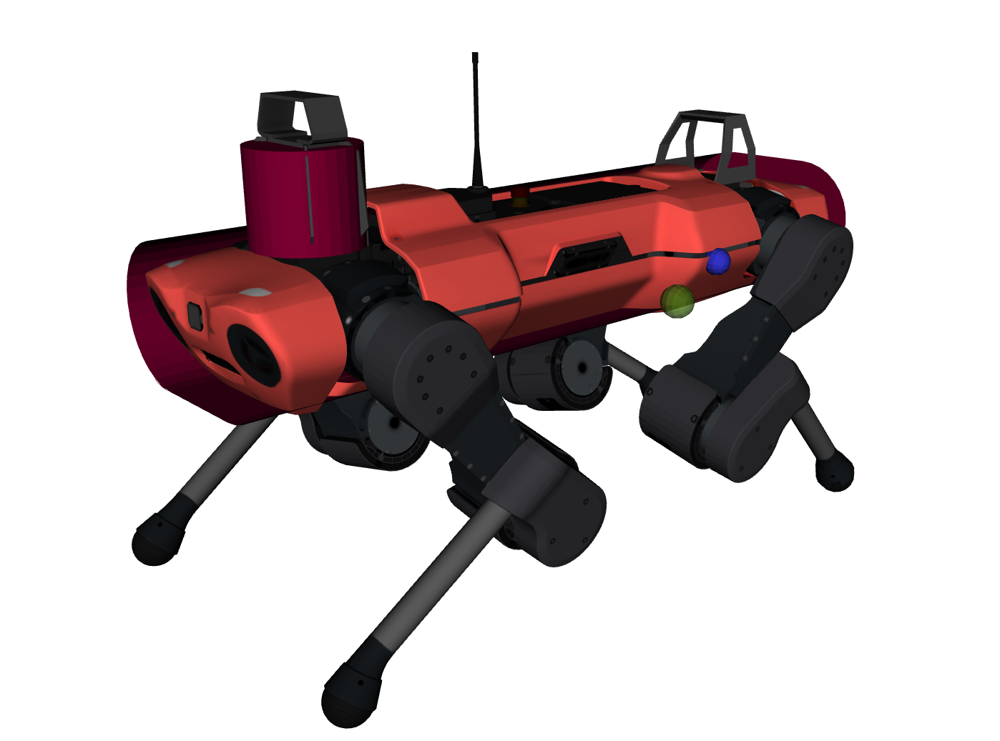
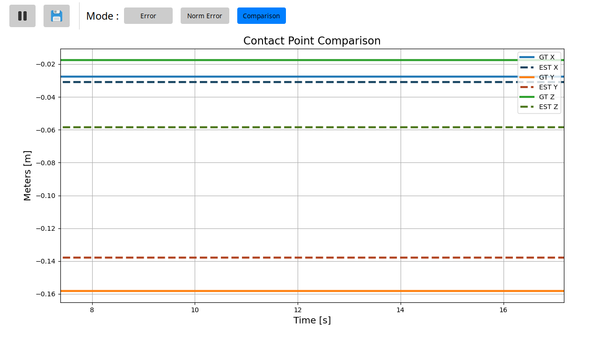

# haptiquad_contacts
<div style="display: flex; align-items: center;">
  <div style="flex: 1; padding-right: 10px;">
    <h2 style="margin-top: 0; margin-bottom: 0.5em;">Description</h2>
<p><code>haptiquad_contacts</code> is part of the 
  <a href="https://github.com/mlisi1/haptiquad/tree/main" target="_blank" rel="noopener noreferrer">haptiquad</a> packages. 
  Its purpose is to estimate the contact point on a body given the wrench measurements (or estimates) acting on its center of mass.
</p>
<p>
<h2 style="margin-top: 0; margin-bottom: 0.5em;">Installation</h2>
This repository is intended to be used alongside <a href="https://github.com/mlisi1/haptiquad_mujoco/tree/main" target="_blank" rel="noopener noreferrer">haptiquad_mujoco</a>. The first requirement is to compile the C++ version of <a href="https://github.com/isl-org/Open3D" target="_blank" rel="noopener noreferrer">Open3D</a>, as it's required for the point estimation. Followingly, the repo can be used:
</p>

<p>

</p>
</div>
<div>

</div>
</div>

```
git clone git@github.com:mlisi1/haptiquad_contacts.git
colcon build
source install/setup.bash
```
## Usage
To use the package with a Mujoco simulation, simply run the following command:
```
ros2 launch haptiquad_contacts haptiquad_estimator_mujoco.launch.py
```
This launch file executes the nodes required for the correct estimation and visualization of the contact point. The launch file can be tweaked with several arguments: 
+ `use_gt:=true` - subscribes to the simulation's F/T measurements instead of using the estimated measurements. Mostly used for debugging purposes.
+ `rviz:=true` - launches rViz configured to visualize the model and the esimated and true contact points
+ `plot:=true` - launches `contact_error_plotter.py`, a simple GUI capable of plotting error, norm error and comparison between the true contact point and the estimated one. It aso allows to save the plots as `.png` images


### Nodes launched:
#### `mujoco_contact_publisher.py`
It suscribes to the mujoco simulation and publishes as a visualization marker only the contacts with a specified object (via the `"object_name"` parameter) on the topic `/visualization/mujoco_contacts`.
For how the Mujoco simulation works, the contact points are expressed in the `world` frame reference. 
#### `model_publisher.py`
Loads the model presnt in the `assets/` folder and publishes it on the topic `/visualization/collision_model` as a visualization marker. This is also used to load the model by the main node.
#### `contact_estimator`
It's the main node that performs the estimation. It utilizes the force and torque measurements to determine the line along which the contact point should lie onto. The relevant topics are the following:
+ `/visualization/estimated_contact` - *published* - a visualization marker representing the estimated point (green) expressed in the `base` reference frame.
+ `/visualization/collision_model` - *subscribed* - as discussed before, it's the topic containing the CAD representation of the robot's base, or its collision shape. It will be loaded by Open3D to perform Raycasting and find the correct estimation point.
+ `/haptiquad_ros2/estimated_forces` - *subscribed* - it's a topic published by [haptiquad_ros2](https://github.com/mlisi1/haptiquad_ros2) and contains the estimated ground reaction forces and wrench acting on the floating base expressed in the `world` reference frame. Only the wrench is used.
+ `/simulation/base_wrench` - *subscribed* - topic from the Mujoco simulation containing the true Force/Torque values acting on the floating base; also expressed in the `world` reference frame. It's used mostly for debugging purposes.

The estimation process can be tweaked with the following parameters:
```yaml
force_tol: 3.0 # How much the wrench norm should be different from the previous to perform the estimation
num_lines: 90000 # Number of lines to cast when searching for the estimation point
tolerance: 1.5 # Maximum error. Points found with higher errors than this parameter will not be published
use_gt: false # Similarly to the launch file parameter; subscribes to true values instead of estimated ones
minimum_force_norm: 5.0 # Minimum force norm to perform the estimation.
```
